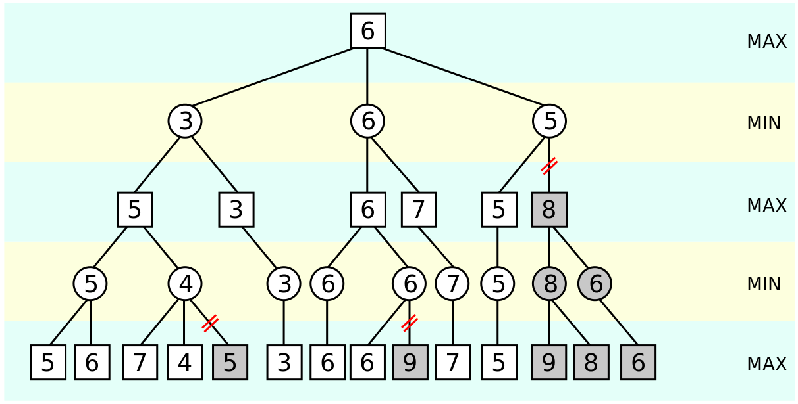

# 面向对象程序设计大程序文档
成员：
3150 范宏昌 
3150 方共凡
3150 杜众舒 
3140103103 郑济元 

## 总体概述及功能介绍
本五子棋游戏采用c++作为开发语言,使用了QT跨平台库，具有以下功能：

- 本机人人对战模式  
	1. 该模式下黑白两方玩家轮流在一个棋盘上下棋  
	2. 上一次落子的一方玩家可以进行悔棋  
	3. 轮到自己下棋的一方玩家可以进行认输  
	4. 游戏中途可以保存对局,可在以后选择加载对局  
	5. 游戏结束可以保存游戏棋谱(带落子顺序标记)  

- 本机人机对战模式
	1. 该模式下默认玩家执黑,电脑AI执白,轮流在一个棋盘上下棋  
	2. 玩家可以进行悔棋  
	3. 玩家可以进行认输  
	4. 游戏中途可以保存对局，可在以后选择加载对局  
	5. 游戏结束可以保存游戏棋谱(带落子顺序标记)  
- $网络人人对战模式^*$  
	1. 该模式下黑白两方玩家各自开一个客户端,连接上服务器后，分别在自己的棋盘上下棋  
	2. 任一方玩家可以在轮到自己下和轮到对方下时申请进行悔棋，待对方同意后即可悔棋  
	3. 任一方玩家可以在轮到自己下和轮到对方下时进行认输  
	4. 游戏结束可以保存游戏棋谱(带落子顺序标记)  

## 使用方法

## 组件（各类）间工作原理
- client
	1. 客户端类，负责与服务端建立连接并通信，在连接成功并服务器端发来开始信号后创建新的一局游戏。
	2. 与主界面的输入相连接，在游戏中发送本地玩家的操作到另一名玩家并接收另一名玩家的操作模拟实施到本地。
	3. 接收本地玩家的悔棋请求并询问另一位玩家的同意。
	4. 接收本地玩家的认输请求并通知另一位玩家。
	### 发送数据功能 sendLocalPlay()
	`void sendLocalPlay(int x, int y);`
	- 将本地的下子位置发送到服务器
	### 请求悔棋功能 sendRegretRequest()
	`void sendRegretRequest();`
	- 向另一位玩家发送悔棋请求，对方会被要求选择是否同意，若同意则悔一步棋
	### 请求认输功能 sendGiveupRequest()
	`void sendGiveupRequest();`
	- 向另一位玩家发送认输请求，结束当前游戏，对方为胜利者
	### 收到游戏开始信号 RemotePlayerReady()
	`void RemotePlayerReady(int GameMode);`
	- 收到该信号表示另一位玩家准备完毕，将开始游戏
	- 新游戏的本地玩家身份由GameMode指定
	### 收到下子信号 getRemotePlay()
	`void getRemotePlay(int x,int y);`
	- 收到该信号表示另一名玩家在x,y位置下了子
	### 执行悔棋信号 excuteRegret()
	`void excuteRegret(int regreter);`
	- 收到该信号表示对方或本地同意悔棋，将以悔棋者为regreter的形式进行悔棋
	### 执行认输信号 excuteGiveup()
	` void excuteGiveup(int giveuper);`
	- 收到该信号表示对方或本地认输，将以认输者为giveuper的形式进行悔棋
	### 另一玩家断开连接信号 RemotePlayerdisconnected()
	`void RemotePlayerdisconnected();`
	- 收到该信号表示另一玩家的连接被断开，游戏直接结束
- server
	1. 服务端类，负责监听客户端的连接请求，并在双方连接后提供转发服务
	2. 记录目前服务端的连接数，分配两个玩家的身份
	3. 在一方玩家断开后断开另一个玩家，初始化服务端（目前仅支持1对玩家进行游戏）
	### 新玩家连接 newPlayerConnected()
	`void newPlayerConnected();`
	- 有新玩家连接，若目前无人连接，则发送等待信号让客户端等待，若有1人已连接，则向双方发送游戏开始信号，更多玩家则忽略（目前仅支持1对玩家进行游戏）
	- 连接后设置好通信的对应信号槽
	### 白方发来数据 dataFromWHITE()
	`void dataFromWHITE();`
	- 白方发来数据，原样转发给黑方
	### 黑方发来数据 dataFromBLACK()
	`void dataFromBLACK();`
	- 黑方发来数据，原样转发给白方
	### 白方断开 whitedisconnected()
	`void whitedisconnected();`
	- 白方断开了连接，则重置白方的套接字，并解除信号槽的连接，并主动断开黑方的连接
	### 黑方断开 blackdisconnected()
	`void blackdisconnected();`
	- 黑方断开了连接，则重置黑方的套接字，并解除信号槽的连接，并主动断开白方的连接
* 人机对战AI  
围棋游戏中AI单独作为一个类，实例化为对象。AI对象拥有与board同步的棋盘拷贝，从而将AI的运算与棋盘隔离。  

	* AI类
   
		```cpp
class GobangAI:public QObject
{
    	Q_OBJECT
	signals:
	    void aiRequestPlay(int x,int y);
	public slots:
	    void makeDecision(int state,int player,int pBoard[SIZE][SIZE],QVector<int> record); //对当前盘面做出决策
	public:
	    GobangAI(int c,int l);
	    GobangAI();
	    GobangAI(int AIcolor);
	    void setLevel(int l);
	    /* Make Decision*/
	private:
	    int getPattern(int teamColor,int x,int y,int dx,int dy);
	    int alphaBeta(int beta,int alpha,int teamColor,int depth,vector<GBPoint>& bestPos);
	    int oneStep(GBPoint p,int teamColor,bool& isattack);
	    int sortPos(bool candidatePos[SIZE][SIZE],list<PosWithScore>& sortedCandi,int teamColor);
	    void getCandidatePos(bool candi[SIZE][SIZE]);     //获得候选落子点
	    int evaluate(int teamColor);                      //评估函数，对盘面评分
	    int isWin(int teamColor,GBPoint p);
	    void updateBoard(int pBoard[SIZE][SIZE]);
	private:
	    int boardCopy[SIZE][SIZE];
	    int level;
	    int team;
	    int enemy;
	    static int PatternScore[13];
};
	```  
	**基本思路：**
	AI类隐藏了决策需要的各种方法，对外提供唯一的决策、以及难度level的设定接口。AI在构造时确定落子方，并根据输入的信息返回输出信息。
	
	* **决策** ：
	当棋盘发生变化时，发出boardChange信号，AI执行  
		
	```cpp
  	void makeDecision(int state,int player,int pBoard[SIZE][SIZE],
   QVector<int> record);  
	```
	该成员函数的会根据信号传递的当前游戏状态、玩家、棋盘状态以及游戏记录做出反馈，若轮到AI方落子，则计算落子位置，并给棋盘发出落子信号。若为玩家落子则直接返回不作处理。
	
	* **博弈树**  
	在决策函数内部： 
	
		```cpp
	 updateBoard(pBoard);
	 ...
	 vector<GBPoint> bestPos;
	 alphaBeta(INFINITY,-INFINITY,team,level,bestPos);
	 ...
    emit aiRequestPlay(x,y);
    
		```
	落子的计算由alphaBeta完成，该函数实现了博弈树的遍历以及Alpha-Beta剪枝。博弈树的实质是计算每一层的极大极小值。在博弈树中，从树根节点至叶节点依次表示AI以及人类对手，每一层之间则可以看做落子动作，因此整个搜索过程就是遍历各种落子的可能性，并在各种方案中选择较优方案。  
	如图所示，在树结构中，每一层都有该落子点的评分。每一层的落子方都会选择对自己最有利的落子点，即从子节点中选择对落子方来说的最高分。因此从AI的角度来看，**MIN层**（人类棋手）会选择子节点中的**最低分**作为本节点的分数；而在**MAX层**，其评分则选取子节点中的**最高分**。  
  
	Alpha-Beta剪枝的作用是减少不必要的搜索，提高效率。
	伪代码如下：
	
		```cpp
	int alphaBeta(int beta,curColor,int alpha,int depth)
	{  
			if(depth==0) return evaluate(boardCopy)
			for every candidated position (x,y)
			{
				boardcopy[x][y] := curColor;
				val: = alphabeta(-alpha,-beta,enemyColor,depth-1);
				boardcopy[x][y] := EMPTY;	//reset
				if(val>beta) return beta   //cut-off
				if(val>alpha)
				{
					alpha:=beta;
					if(depth==initialDepth)	//the original depth
						setBestChoice(x,y);	
				}
			}
			return alpha;
	}
		```  
	采用取负值并交换alpha、beta的实现方式，由于棋手双方互相对立，在某一层发生剪枝的情况为在该位置落子，对方会存在一个落子点使得己方得分低于其余点的最低分。
	当递归至深度0（也可从0开始递归至最大深度），执行评价函数对当前局面打分，递归开始出栈，之后的每一个节点评分都从子节点的得分获取。
	* **评价函数**  
	评价函数采用分值表实现，首先要获取当前局面的棋子布局，调用:
	`int getPattern（int teamColor,int x,int y,int dx,int dy）`
	该函数对存在指定颜色棋子的每一个位置进行检查，检查的原则为**最左原则**，即对在一个方向上，从每个pattern中的最左边的棋子开始开始搜索，其余点不加判定。 
	 
		分值|Pattern|序号  
	----|--------------|------  
	 560|    L5 |       0  
    280|    L4 |      1  
    280|    D4 * 2 |   2  
    280|     D4 L3|     3  
    140|     L3 * 2 |   4    
    70|     D3 L3 |    5  
    60|     D4  |      6  
    50|     L3 |       7  
    40|     L2 * 2 |   8  
    30|     D3   |     9  
    20|     L2  |      10  
    10|     D2   |     11  
    0|     Single Piece  |    12 
    注：表格中L表示“活”，D表示“死”，如D4表示“死4”，有一端被对手拦截；D4*2表示“双死4”。棋局最终评分取所有pattern中最高值。此类评分表通常根据人的经验、或者机器学习优化参数的方法得到，因此带有一定主观因素。
    
    * **其他优化**  
	由于遍历博弈树的难度较大，因此增加部分额外处理优化性能。
	
		1. 选取部分落子点作为候选点：选取落子的位置的上下左右4x4范围。    
		2. 对候选节点单步评分并排序：优先搜索单步评分高的可以增加之后剪枝的概率。
		3. 对必胜/必输增加额外判定，直接选取该点作为落子点。

	
	
    
    


## 各类详细uml图
- GobangBoard(棋盘底层存储)

- GobangAI(电脑AI)

- BoardUi(棋盘界面)

- Client(客户端类)

- Dialog（带界面服务器类）

## 各源代码文件介绍
- 客户端部分主程序
`gobangclient/main.cpp`
- 定义了整个程序中用到的宏名
`gobangclient/marcos.h`
- 主窗口的头文件、cpp文件和ui设计文件
`gobangclient/mainwindow.h`，`gobangclient/mainwindow.cpp`，`gobangclient/mainwindow.ui`
- 棋盘界面类的头文件、cpp文件
`gobangclient/boardui.h`，`gobangclient/boardui.cpp`
- 客户端类的头文件、cpp文件
`gobangclient/client.h`，`gobangclient/client.cpp`
- 电脑AI类的头文件、cpp文件
`gobangclient/gobangai.h`，`gobangclient/gobangai.cpp`
- 棋盘底层存储类的头文件、cpp文件
`gobangclient/gobangboard.h`，`gobangclient/gobangboard.cpp`
- 服务器类头文件、cpp文件和ui设计文件
`gobangserver/dialog.h`，`gobangserver/dialog.cpp`，`gobangserver/dialog.ui`，
- 服务器端主程序
`gobangserver/main.cpp`

